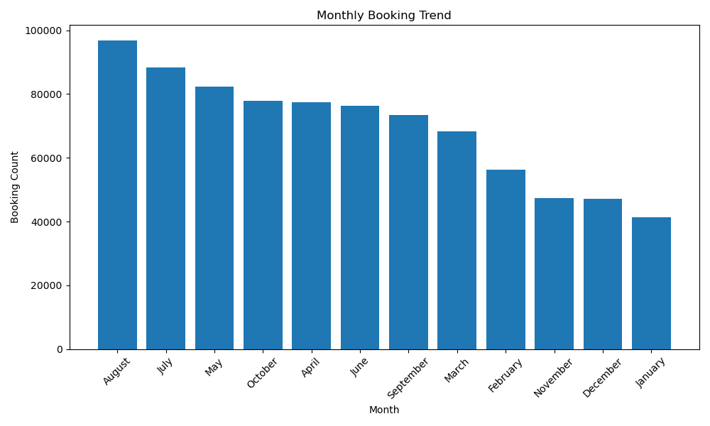
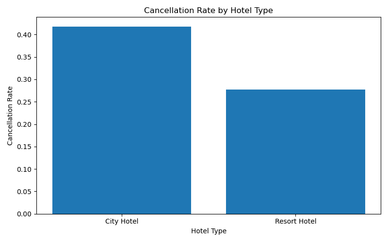
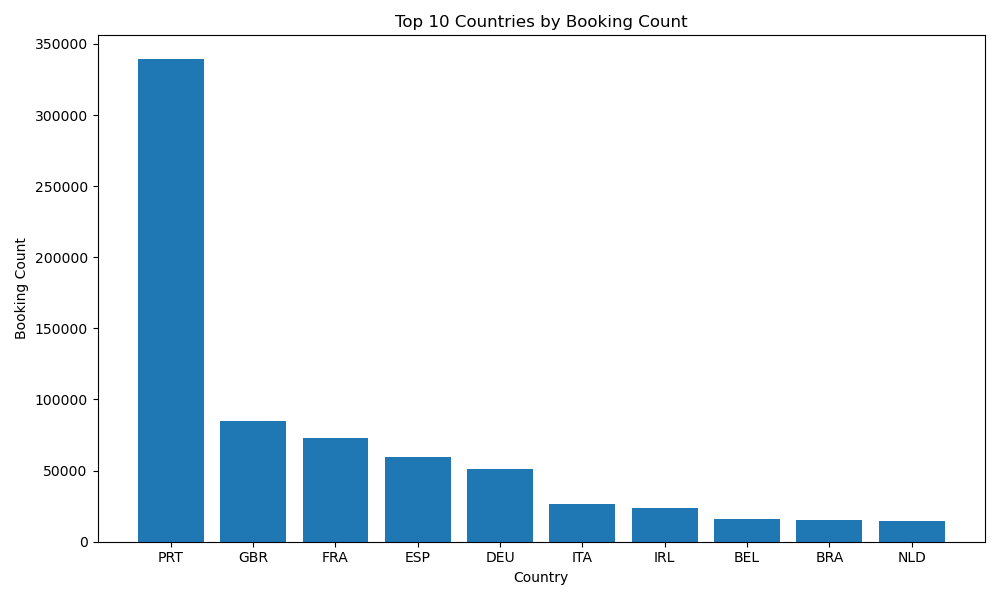
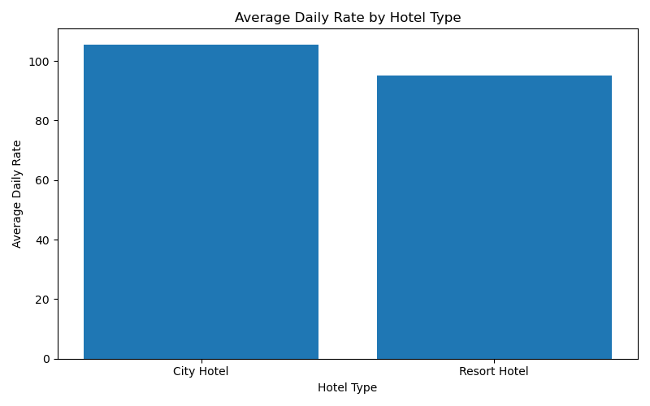

# Analyze Hotel Booking Trends and Customer Behavior

## 1. 문제 정의 (Problem Definition)

이 프로젝트의 목표는 호텔 예약 데이터를 분석하여 고객의 예약 패턴과 행동 특성을 파악하는 것이다.

호텔 예약 데이터에는 호텔 유형, 예약 취소 여부, 예약 시점, 고객 국가, 숙박 기간, 평균 일일 요금(ADR) 등의 정보가 포함되어 있다. 본 프로젝트에서는 이러한 데이터를 활용하여 호텔 예약 수요와 고객 행동의 특징을 분석한다.

주요 분석 내용은 다음과 같다.

- 호텔 예약 추세 분석
- 호텔 유형별 예약 취소율 분석
- 고객 국가별 예약 패턴 분석
- 성수기/비수기 예약 변화 분석
- 호텔 유형별 평균 일일 요금(ADR) 비교
- 고객 행동 기반 인사이트 도출

사용 데이터는 Kaggle의 **Hotel Booking Demand Dataset**이다.

- Dataset: Hotel Booking Demand Dataset
- Source: https://www.kaggle.com/datasets/jessemostipak/hotel-booking-demand
- 주요 컬럼: `hotel`, `is_canceled`, `lead_time`, `arrival_date_month`, `country`, `customer_type`, `adr`, `reservation_status` 등

원본 데이터 파일의 크기는 약 16MB이므로, 본 프로젝트에서는 호텔 예약 데이터가 여러 날짜에 걸쳐 누적 수집되는 상황을 가정한다. 이를 위해 Python 수집 스크립트를 작성하여 원본 데이터를 여러 개의 일별 batch 파일로 생성한다. 각 batch 파일에는 `collection_date`와 `batch_id` 컬럼을 추가하여 데이터 수집 날짜와 batch 번호를 구분한다.

생성된 batch 데이터는 총 7개의 CSV 파일로 구성되며, 전체 크기는 100MB 이상이다. 이는 기말 프로젝트 요구사항인 누적 100MB 이상의 데이터 확보 조건을 만족하기 위한 것이다.

이 프로젝트는 대용량 데이터를 효율적으로 저장 및 처리하기 위해 클라우드 기반 환경(GCP)과 Hadoop 기반 분산 처리 기술을 활용한다.

---

## 2. 기술 스택 (Technology Stack)

프로젝트에서 사용한 기술은 다음과 같다.

### Python

- Kaggle 원본 데이터를 기반으로 일별 batch 데이터 생성
- `collection_date`, `batch_id` 컬럼 추가
- 데이터 수집 과정을 재실행 가능한 스크립트로 구현

### Hadoop HDFS

- 누적 100MB 이상의 호텔 예약 batch 데이터 저장
- 분산 파일 시스템 기반의 데이터 저장소로 활용
- HDFS 경로: `/user/maria_dev/hotel_booking/raw`

### Apache Spark

- Spark DataFrame 기반 데이터 전처리 및 분석 수행
- 결측치 처리, 컬럼 선택, 필터링, 집계 작업 수행
- 처리된 데이터를 Parquet 형식으로 HDFS에 저장

### Google Cloud Platform (GCP)

- 클라우드 기반 Hadoop/Spark 실행 환경
- HDP Sandbox 실습 환경 실행

### Matplotlib

- 분석 결과 시각화
- 월별 예약 추세, 호텔 유형별 취소율, 국가별 예약 수, ADR 비교 그래프 생성

---

## 3. 시스템 구조 (System Architecture)

프로젝트의 전체 파이프라인은 다음과 같다.

```text
Hotel Booking Dataset (Kaggle)
        ↓
Python Data Collection Script
        ↓
Daily Batch CSV Files
(collection_date, batch_id 컬럼 추가)
        ↓
HDFS 저장
        ↓
Spark Data Processing
        ↓
데이터 정제 및 전처리
        ↓
Spark Analysis
        ↓
예약 패턴 분석
취소율 분석
국가별 예약 패턴 분석
ADR 분석
        ↓
CSV 결과 저장
        ↓
Matplotlib Visualization
        ↓
최종 리포트 및 발표 자료 작성
```

---

## 4. Repository Structure

```text
Hotel_Booking_Analysis/
├── README.md
├── data/
│   └── sample/
│       └── hotel_bookings_sample.csv
├── output/
│   ├── results/
│   │   ├── monthly_booking_trend.csv
│   │   ├── cancellation_rate_by_hotel.csv
│   │   ├── top_countries.csv
│   │   └── adr_by_hotel.csv
│   └── figures/
│       ├── monthly_booking_trend.png
│       ├── cancellation_rate_by_hotel.png
│       ├── top_countries.png
│       └── adr_by_hotel.png
├── src/
│   ├── ingest/
│   │   ├── create_batches.py
│   │   └── upload_to_hdfs.sh
│   ├── pipeline/
│   │   └── process_hotel_bookings.py
│   └── analyze/
│       ├── analyze_hotel_bookings.py
│       ├── save_analysis_results.py
│       └── visualize_results.py
└── .gitignore
```

대용량 원본 데이터와 batch CSV 파일은 GitHub에 업로드하지 않고 `.gitignore`로 제외하였다. 대신 `data/sample/` 폴더에 샘플 데이터를 포함하였다.

---

## 5. 데이터 수집 및 적재 (Data Collection and Loading)

### 5.1 Batch 데이터 생성

원본 Kaggle CSV 파일을 기반으로 7개의 일별 batch CSV 파일을 생성한다.

```bash
~/miniconda3/bin/python src/ingest/create_batches.py
```

생성되는 파일 예시는 다음과 같다.

```text
data/raw/hotel_bookings_batch_01.csv
data/raw/hotel_bookings_batch_02.csv
data/raw/hotel_bookings_batch_03.csv
data/raw/hotel_bookings_batch_04.csv
data/raw/hotel_bookings_batch_05.csv
data/raw/hotel_bookings_batch_06.csv
data/raw/hotel_bookings_batch_07.csv
```

각 batch 파일에는 다음과 같은 추가 컬럼이 포함된다.

- `collection_date`: 데이터 수집 날짜
- `batch_id`: batch 번호

### 5.2 HDFS 업로드

생성된 batch CSV 파일을 HDFS에 업로드한다.

```bash
bash src/ingest/upload_to_hdfs.sh
```

HDFS 저장 경로는 다음과 같다.

```text
/user/maria_dev/hotel_booking/raw
```

업로드 확인 명령어는 다음과 같다.

```bash
hadoop fs -ls /user/maria_dev/hotel_booking/raw
```

---

## 6. 데이터 전처리 (Data Preprocessing)

Spark DataFrame을 사용하여 HDFS에 저장된 CSV 파일을 읽고 전처리를 수행한다.

```bash
spark-submit src/pipeline/process_hotel_bookings.py
```

전처리 과정은 다음과 같다.

1. HDFS의 raw CSV 파일 읽기
2. 분석에 필요한 컬럼 선택
3. 결측치 처리
   - `children`: 0으로 대체
   - `country`: Unknown으로 대체
   - `adr`: 0으로 대체
4. 이상값 필터링
   - `adr >= 0`
   - `adults > 0`
5. 처리된 데이터를 Parquet 형식으로 저장

전처리 결과 저장 경로는 다음과 같다.

```text
/user/maria_dev/hotel_booking/processed
```

실행 결과, 총 처리된 row 수는 다음과 같다.

```text
Total rows: 832902
```

---

## 7. 분석 방법 (Analysis Method)

Spark를 사용하여 다음 네 가지 분석을 수행하였다.

### 분석 질문 1

월별 호텔 예약 수는 어떻게 변화하는가?

### 분석 질문 2

City Hotel과 Resort Hotel의 예약 취소율은 어떻게 다른가?

### 분석 질문 3

어느 국가의 고객이 가장 많은 예약을 하는가?

### 분석 질문 4

호텔 유형별 평균 일일 요금(ADR)은 어떻게 다른가?

분석 실행 명령어는 다음과 같다.

```bash
spark-submit src/analyze/analyze_hotel_bookings.py
```

분석 결과를 CSV 파일로 저장하기 위해 다음 명령어를 실행한다.

```bash
spark-submit src/analyze/save_analysis_results.py
```

분석 결과는 HDFS의 다음 경로에 저장된다.

```text
/user/maria_dev/hotel_booking/output
```

이후 로컬 프로젝트 폴더의 `output/results/`에도 결과 CSV 파일을 저장하였다.

---

## 8. 분석 결과 (Analysis Results)

### 8.1 월별 예약 추세

월별 예약 수 분석 결과, 8월의 예약 수가 가장 많았다.

| Month | Booking Count |
|---|---:|
| August | 96,803 |
| July | 88,277 |
| May | 82,348 |
| October | 77,917 |
| April | 77,399 |

8월과 7월의 예약 수가 높은 것은 여름 휴가철과 성수기의 영향으로 해석할 수 있다.

### 8.2 호텔 유형별 취소율

| Hotel Type | Total Bookings | Canceled Bookings | Cancellation Rate |
|---|---:|---:|---:|
| City Hotel | 552,580 | 230,965 | 41.8% |
| Resort Hotel | 280,322 | 77,840 | 27.8% |

City Hotel의 취소율은 약 41.8%로 Resort Hotel보다 높게 나타났다. 이는 도시 호텔 이용 고객이 비즈니스, 단기 여행, 일정 변경 등의 영향을 더 많이 받기 때문으로 볼 수 있다.

### 8.3 국가별 예약 수

국가별 예약 수 상위 결과는 다음과 같다.

| Country | Booking Count |
|---|---:|
| PRT | 339,080 |
| GBR | 84,728 |
| FRA | 72,632 |
| ESP | 59,822 |
| DEU | 50,897 |

PRT의 예약 수가 가장 높게 나타났으며, 그 뒤를 GBR, FRA, ESP, DEU가 따랐다. 이를 통해 특정 국가 고객의 예약 비중이 매우 높다는 것을 확인할 수 있다.

### 8.4 호텔 유형별 평균 일일 요금

| Hotel Type | Average Daily Rate |
|---|---:|
| City Hotel | 105.57 |
| Resort Hotel | 94.99 |

City Hotel의 평균 일일 요금이 Resort Hotel보다 높게 나타났다. 이는 도시 호텔의 수요와 가격 구조가 리조트 호텔과 다르기 때문으로 해석할 수 있다.

---

## 9. 시각화 결과 (Visualization Results)

분석 결과를 기반으로 Matplotlib을 사용하여 그래프를 생성하였다.

### 9.1 Monthly Booking Trend



### 9.2 Cancellation Rate by Hotel Type



### 9.3 Top Countries by Booking Count



### 9.4 Average Daily Rate by Hotel Type



시각화 실행 명령어는 다음과 같다.

```bash
~/miniconda3/bin/python src/analyze/visualize_results.py
```

---

## 10. 결론 (Conclusion)

본 프로젝트에서는 Kaggle의 Hotel Booking Demand Dataset을 활용하여 호텔 예약 데이터 분석 파이프라인을 구축하였다. 원본 데이터를 여러 개의 batch 파일로 생성하고, 이를 HDFS에 저장한 뒤 Spark DataFrame을 이용하여 전처리 및 분석을 수행하였다.

분석 결과, 호텔 예약은 8월에 가장 많이 발생하였으며, City Hotel은 Resort Hotel보다 더 높은 취소율을 보였다. 또한 PRT 고객의 예약 수가 가장 높았고, City Hotel의 평균 일일 요금이 Resort Hotel보다 높은 것으로 나타났다.

이를 통해 호텔 예약 패턴은 예약 시기, 호텔 유형, 고객 국가에 따라 차이가 있음을 확인할 수 있었다.

---

## 11. 한계 및 향후 계획 (Limitations and Future Work)

본 프로젝트에서는 Kaggle의 정적 데이터셋을 사용하였기 때문에 실제 실시간 예약 데이터 수집은 수행하지 못했다. 대신 원본 데이터를 여러 개의 일별 batch 파일로 나누어 누적 수집 상황을 가정하였다.

향후에는 다음과 같은 확장이 가능하다.

- Kafka 또는 Spark Streaming을 활용한 실시간 예약 이벤트 처리
- Hive 또는 Spark SQL을 활용한 추가 분석
- Streamlit, Superset 등을 활용한 대시보드 구현
- 예약 취소 여부를 예측하는 머신러닝 모델 적용
- 고객 유형, 숙박 기간, lead time과 취소율 사이의 관계 분석

---

## 12. 실행 순서 요약 (Run Guide Summary)

HDP Sandbox 환경에서 다음 순서대로 실행한다.

```bash
# 1. batch data creation
~/miniconda3/bin/python src/ingest/create_batches.py

# 2. upload batch files to HDFS
bash src/ingest/upload_to_hdfs.sh

# 3. preprocessing with Spark
spark-submit src/pipeline/process_hotel_bookings.py

# 4. analysis with Spark
spark-submit src/analyze/analyze_hotel_bookings.py

# 5. save analysis results
spark-submit src/analyze/save_analysis_results.py

# 6. create visualizations
~/miniconda3/bin/python src/analyze/visualize_results.py
```

---

## 13. 참고 자료 및 AI 사용 (References and AI Usage)

### Dataset

- Hotel Booking Demand Dataset, Kaggle  
  https://www.kaggle.com/datasets/jessemostipak/hotel-booking-demand

### Official Documentation

- Apache Hadoop HDFS Documentation  
  https://hadoop.apache.org/docs/

- Apache Spark Documentation  
  https://spark.apache.org/docs/latest/

- Matplotlib Documentation  
  https://matplotlib.org/stable/

### AI Tool Usage

본 프로젝트의 코드 작성, 오류 수정, README 정리 과정에서 ChatGPT를 보조 도구로 사용하였다. 단, 프로젝트 주제 선정, 데이터 처리 과정 구성, HDP Sandbox에서의 실행, HDFS 업로드, Spark 실행 결과 확인은 직접 수행하였다.